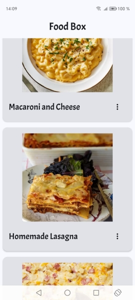
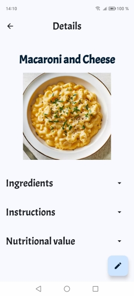
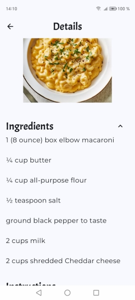

# FoodBox

FoodBox is an Android application that allows users to save their favourite recipes with ease. Users
can add photos, steps and ingredients for the recipe.
The photos feature is available only on devices running Android 10+.

The App was made using Kotlin and Jetpack Compose. It also uses Coil for loading images and Room to
manage the database.

**Features**:

**Home Screen**: displays the list of recipes the user has added

    

**Details Screen**: shows details of the saved recipe

    
    

**Edit Screen**: edit already added recipes. Users can navigate to this screen from the details
screen
or by selecting the 'edit' option in the dropdown menu on the home page

**Delete**: users can delete a recipe from the dropdown menu in the home screen.

**Adding recipes**: new recipes can be added to the database from the floating action button in the
home screen.

**Implementation details:**

- ViewModels are used to hold UI state and separate UI layer from the data layer
- Navigation between screens is defined in `RecipeNavGraph`, and it uses a NavGraph to make the
  routes between screens
- For persistent storage, the app uses the Room library. `RecipeDao` contains the queries that can
  be made on the database
- For displaying the images, the app uses Coil. Images are displayed in an `AsyncImage` composable,
  and it case of an error, it displays a placeholder image.
- App chooses between dark and light mode based on the system settings.

